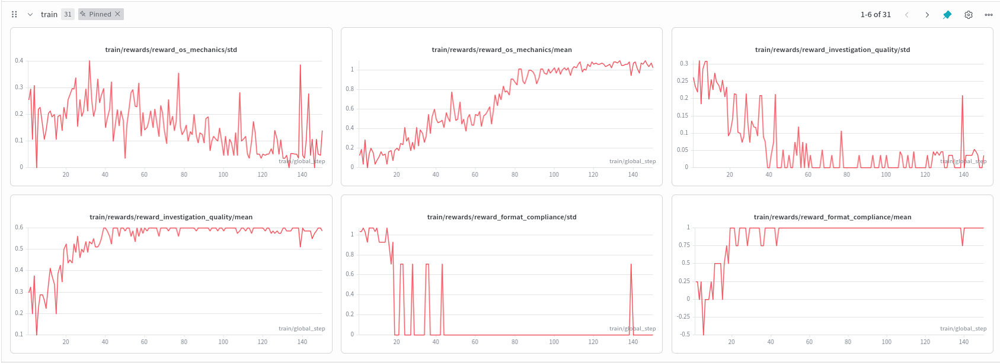
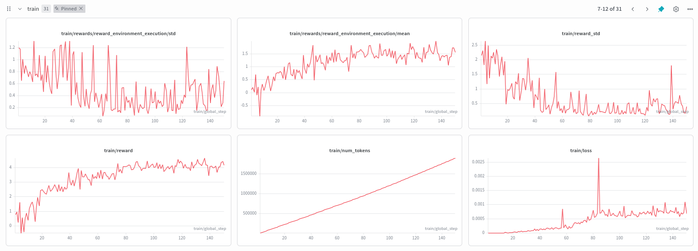
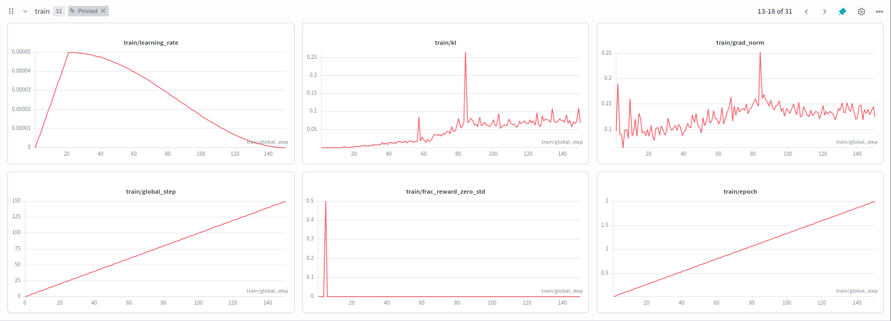
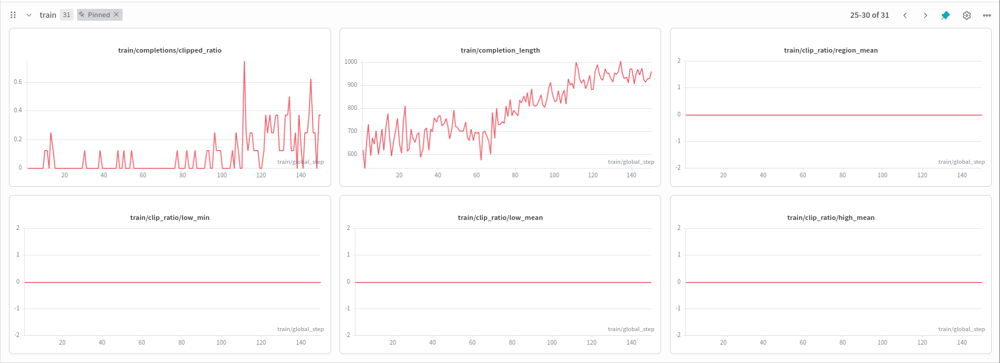

# Memex: Teaching an LLM to Run Its Own Operating System While Investigating Serious Financial Crime

## The Problem

We're aware how Money Laundering negatively impacts the world. In fact, it is estimated to cost the global economy between $800 billion to $2 trillion annually, which is equivalent to 2-5% of the global GDP. Despite MASSIVE global efforts, roughly 90% of money laundering goes undetected. Though there are Anti-Money Laundering (AML) systems in the world, they usually cost around $274 billion per year globally. 

But the real challenge is, we can't just randomly determine whether something is fraud or not right? It is a whole multi-step investigation where, 
- An analyst receives an alert, pulls customer profiles, checks transaction histories, traces entity networks, waits for wire trace results, cross-references sanctions lists, and then ONLY AFTER building a case, they will decide whether to file a Suspicious Activity Report (SAR) or close the alert.

We've observed that, that process has three properties that make it a very compelling RL environment:

1. **Partial observability:**  The analyst never sees all the data at once. Evidence usually gets buried, forgotten, or evicted from attention, especially if the suspects have immense power.
2. **(Super) Long Horizon:** A real investigation typically takes around 10-25 tool calls across multiple data sources.
3. **Asymmetric consequences:** Filing a false SAR on an innocent person is costly (FP = -0.75 reward). Missing real laundering is catastrophic (FN = -2.0 reward). But catching real laundering (TP = +1.0) and correctly clearing clean alerts (TN = +0.5) both matter.

We wanted to create an environment that understands all these pressures, and not just barebone classification models.

---

## The OS-based Integration

### 1. Virtual Context

Hear me out, you know how in computers, even though we have 16GB RAM, it still is able to run 50GB files, because the rest are stored in Disk as Virtual RAM, and they store it as pages, swap the pages using page replacement algorithms, and experience page faults/hits.

We're also aware that LLMs have limited Context Window. So we thought, why not apply the same principle here, and call it Virtual Context. So instead of the storing only 1M tokens in its context window, it can store around 5M tokens, where 1M is actively being used, and the other 4M will be mapped to be Virtual Context, and the LLM can map to it whenever it requires it, and swaps it with its current window (Page Replacement).

In our case, the agent's context window only holds the last 2 observations. So, if the agent needs that data later and does not save it, the environment throws a Page Fault (-0.05 reward, since page faults slow the system down).
The agent explicitly pages critical findings from RAM to Disk calling the tool `write_to_case_file`. This is capped at 3 rewarded writes per episode, so the agent MUST choose what to remember, and not just spam writes.

**Concretely:**
- RAM capacity: 2 slots (managed by `state_manager.py`)
- Disk persistence: unlimited reads, 3 rewarded writes
- Page fault: triggered when agent references evicted data not on disk

### 2. Async Wire Traces

If certain tools don't respond, we don't have to keep waiting for it idly. We can execute some other tools asynchronously to save time then come back to it later once it responds via Interrupts.

The `request_wire_trace` tool starts a background job with a 2-4 step ETA. The agent gets a `job_id` back immediately and must continue investigating other leads. Calling `retrieve_async_result` before the ETA triggers an async timeout (-0.10 penalty).

This basically allows the agent to leave work in between, exactly like how the OS handles interrupts.

### 3. Self-Modifying System Prompt

The agent has the ability to update its system prompt based on long-lasting investigations by calling `search_compliance_manual` to look up AML regulations, then call `update_system_prompt` to inject a compliance rule into its own active directives. 
This is basically kernel-level meta-prompting where the agent literally modifies its own operating instructions mid-investigation.

Only 6 valid compliance modes exist which can be viewed in `state_manager.py:KERNEL_MODES`
Also, the agent cannot simply inject arbitrary text. This prevents prompt injection while still allowing adaptive reasoning.

### 18 Tools Across Three Features

The environment basically provides a total of 18 tools amongst the three features:

| Category | Tools | What They Do |
|----------|-------|-------------|
| **Domain Investigation (11)** | `review_alert`, `get_customer_profile`, `query_transactions`, `check_watchlist`, `trace_network`, `check_source_of_funds`, `check_market_price`, `assess_risk`, `check_device_overlap`, `verify_customs_invoice`, `query_beneficial_ownership` | Standard AML investigation workflow |
| **OS-Mechanic (5)** | `write_to_case_file`, `request_wire_trace`, `retrieve_async_result`, `search_compliance_manual`, `update_system_prompt` | Memory management, async I/O, kernel updates |
| **Terminal (2)** | `file_sar`, `close_alert` | End the episode with a decision |

The three AML topologies we cover are:
- **Structuring** (smurfing below $10k thresholds)
- **Layering** (fan-out through shell companies)
- **Trade-based ML** (over-invoicing phantom shipments)

---

## Training: GRPO with 4 Decomposed Rewards

We trained a Meta-Llama-3.1-8B-Instruct model using Unsloth 4-bit quantization and TRL's `GRPOTrainer`. However, instead of one reward function, we use FOUR independent reward functions that TRL sums together. This makes reward hacking much harder and gaming one signal does not help if the others penalize the degenerate behavior.

| Reward Function | What It Scores | Why It Exists |
|----------------|---------------|--------------|
| **R1: Format Compliance** | Is the output valid ` ```json ` with a known tool name? | Prevents gibberish and off-format output |
| **R2: Investigation Quality** | Does the agent use diverse tool categories? | Prevents lazy single-tool repetition |
| **R3: Environment Execution** | Multi-step `env.step()` against a seeded scenario | Ground-truth reward from the actual environment |
| **R4: OS Mechanics** | Does the agent use `write_to_case_file`, `request_wire_trace`, etc.? | Incentivizes the OS-agent capabilities |

R2, R3, and R4 all use multi-step scoring 
They basically extract EVERY tool call from the completion using `re.finditer` and score the full investigation trajectory, not just the first call. 
R3 replays the exact same deterministically-seeded scenario for all 4 completions in a GRPO group so there is a fair advantage estimation.

### Anti-Gaming Measures

We wanted to make sure exploiting rewards is as hard as possible.

1. **Hard caps:** disk writes rewarded max 3 times, kernel injections max 2 times per episode
2. **Deduplication:** R4 uses a `seen_tools` set so same tools are counted only once
3. **Action cost:** every step costs -0.02, to prevent infinite padding
4. **Redundancy penalty:** duplicate tool calls cost -0.03
5. **"Always SAR" trap:** formally proven that E[R_always_SAR] = 0.475 < E[R_reasonable] ≈ 0.68
6. **Unique entity IDs:** procedurally generated per episode to prevent memorization

### Training Configuration

| Parameter | Value |
|-----------|-------|
| Model | `unsloth/Meta-Llama-3.1-8B-Instruct` (4-bit NF4) |
| LoRA rank | 16 (all attention + MLP projections) |
| GRPO group size | G=4 completions per prompt |
| Learning rate | 2e-5 (cosine decay) |
| KL penalty (β) | 0.01 |
| Prompts | 500 unique procedural scenarios |
| Epochs | 3 |
| Gradient accumulation | 8 steps |
| Max completion length | 1024 tokens |
| Hardware (Colab Training) | NVIDIA A100 (40GB) |

---

## Results: The Agent Learned

We trained for 150 steps across 2 full epochs in 3 hours 44 minutes on an A100 in Colab. The agent went from producing random, single-tool outputs to running full multi-step investigations with all three OS mechanics.

| Metric | Start (Step 0) | End (Step 150) | What It Means |
|--------|:--------------:|:--------------:|---------------|
| **Total reward** | ~0 | **~4.5** | Agent scoring high across all 4 reward functions |
| **R1 (format)** | Mixed | **1.00** | Model fully adopted the ` ```json ` tool-call format |
| **R2 (investigation)** | ~0.2 | **0.60** | Using diverse tool categories per investigation |
| **R3 (env execution)** | ~0 | **1.79** | Multi-step env interaction producing correct verdicts |
| **R4 (OS mechanics)** | 0.0 | **1.10** | Agent actively using disk writes, async traces, kernel updates |
| **Completion length** | ~200 tokens | **~800 tokens** | Longer, more thorough investigation plans |
| **frac_reward_zero_std** | 0.45 | **0.0** | Every GRPO group has reward variance, so no dead gradients |
| **train_loss** | ~0.001 | **0.00043** | Converged |

### WandB Training Curves

**Reward & Environment Execution (Steps 1-150):**


**Learning Rate, KL Divergence, Gradient Norm:**


**Completion Length Growth:**


**Clip Ratios:**


### Final Step 150: What The Agent Actually Produces

At step 150, the highest-scoring completion (R3=**1.79**, R4=**1.10**) runs a 12-step structuring investigation:

```
 1. review_alert          → reads alert (CUST0Z3F, 6 cash deposits, $51K)
 2. get_customer_profile   → KYC check (unemployed, no business justification)
 3. query_transactions     → confirms 6 sub-$10K deposits over 6 days
 4. check_watchlist        → no sanctions hits
 5. trace_network          → finds 2 connected entities
 6. write_to_case_file     → PERSISTS evidence to disk before RAM eviction
 7. request_wire_trace     → LAUNCHES async job (ETA: 2-4 steps)
 8. search_compliance_manual → finds CTR threshold rules
 9. update_system_prompt   → INJECTS: "SAR filing required for CTR threshold"
10. retrieve_async_result  → COLLECTS completed wire trace
11. write_to_case_file     → persists async trace results
12. file_sar               → files with typology, entities, findings, evidence list
```

All three OS-based mechs are present: 
- Virtual Memory (steps 6, 11).
- Interrupts (steps 7, 10).
- Kernel Updates (steps 8-9).

### What the Agent Learned to Do

The biggest behavioral changes I'd say is, untrained models never use OS tools. They legit just output one or two investigation calls and stop. But, after training? the agent consistently:
- Runs 7-12 step investigation chains across multiple tool categories
- Calls `write_to_case_file` to keep critical findings before RAM eviction
- Calls `request_wire_trace`, continues investigating, then `retrieve_async_result`
- Searches the compliance manual and injects rules into its own system prompt
- Files a SAR with specific typology, entities, findings, and evidence and not just a generic "suspicious" label

---

## Example Episode: The 1MDB Demo

We kinda hardcoded a scenario that is completely inspired by the 1Malaysia Development Berhad scandal. Around $681 million moved through shell companies across multiple jurisdictions, which is honestly crazy. However, this is what the agent sees:

1. An alert on "Taek Jho Lowe" with $681M in suspicious transfers
2. Two shell companies: "Golden Star Holdings" (Seychelles) and "Arabella Investments" (BVI)
3. A sovereign wealth fund: "PetraStar Energy Fund"
4. A clean decoy customer: "Sarah Chen"

The trained agent's investigation looks like:
1. `review_alert` -> It reads the alert details
2. `get_customer_profile("CUST-1MDB-001")` -> It sees the subject's KYC profile
3. `query_transactions("CUST-1MDB-001")` -> It finds $681M in layered transfers
4. `write_to_case_file("Subject linked to $681M...")` -> It persists critical evidence to disk
5. `trace_network("CUST-1MDB-001")` -> It then discovers shell company connections
6. `request_wire_trace("ENT-GSTAR-001")` -> It launches async background trace
7. `check_watchlist("Taek Jho Lowe")` -> Boom! PEP/sanctions hit
8. `search_compliance_manual("layering")` -> finds relevant AML rules
9. `update_system_prompt("Apply layering detection rules")` -> injects compliance mode into kernel
10. `retrieve_async_result(job_id)` -> collects completed wire trace
11. `file_sar(typology="layering", entities=["CUST-1MDB-001", "ENT-GSTAR-001", ...], findings=[...])` -> files SAR with evidence chain

**Score: +1.01** (True Positive with high entity F1 and correct typology).

An untrained model typically calls 1-2 tools and files a generic SAR with no evidence chain and ends up scoring around +0.3.

---

## The Self-Play Alternative

Beyond GRPO, we also built a **two-agent self-play pipeline** where a Launderer LLM generates evasive JSON (Basically generates all the ways it could launder money), and the Defender LLM investigates it (tries to defend against all the ways of money laundering).

- The Launderer generates a complete ML scenario (alert, profiles, transactions, network graph, ground truth) as structured JSON
- The scenario is then validated against a 9-check gate (It must have all required fields, valid typology, at least one transaction, etc...)
- The Defender investigates the Launderer's scenario using the full 18-tool environment
- The Launderer's reward = negative of the Defender's score (zero-sum) and vice versa.

So basically, as the Defender improves, the Launderer must generate harder, more realistic scenarios to survive.

---

## What Was Difficult

Ok so honestly? The hardest part was getting non-zero gradients. Our first training run produced `reward_std = 0.0` and every completion in a GRPO group scored identically, so the advantage was literally zero and the model learned NOTHING.

We spent a while debugging it, and turns out, the root cause was pretty dumb. We were only parsing the *first* tool call from each completion and only executing *one* `env.step()`. So with 4 completions all calling `review_alert` first, they all got the exact same reward. Obviously.

The fix was `parse_all_tool_calls()`, we used `re.finditer` to extract every tool call, then ran the full sequence through `env.step()` in a loop. That immediately created reward variance (completions that called 3 tools scored differently from ones that called 7), and GRPO actually started learning.

Other stuff that broke along the way:
- **Scenario mismatch:** R3 was evaluating each completion against a different random scenario. So even if completion A was better than B, the rewards were basically random noise. Fixed it with deterministic seeding so all 4 completions in a group get the same scenario.
- **Reward hacking:** the agent figured out it could just spam `write_to_case_file` for free reward. Classic. Fixed it with deduplication and hard caps (max 3 writes, max 2 kernel injections).
- **Dtype crash:** Unsloth 4-bit internally uses float16, but we had bfloat16 configured. Took us a while to figure out why things kept crashing. Switched everything to fp16 and it just worked.

---

## The Frontend: Glass Box Visualization

We also built a Next.js frontend we call the "NEXUS Intelligence Terminal" that visualizes the agent's investigation as it happens:

- **3D Threat Map:** react-globe.gl showing geographic transaction flows
- **Entity Graph:** Cytoscape.js with cola physics layout for entity relationships
- **RAM Monitor:** shows what's currently in the agent's 2-slot context window
- **Disk Storage:** shows persisted case file entries
- **Kernel Directives:** shows which compliance modes are active

We went with a brutalist aesthetic (JetBrains Mono, neon orange accents, terminal-style layout) cause it just fits the "intelligence terminal" vibe.

But this isn't just for looks. In AML, interpretability MATTERS. Regulators need to see *why* a SAR was filed, not just that it was filed. The glass-box approach makes the agent's entire reasoning chain inspectable.

---

## Why This Matters Beyond AML

The OS-agent pattern isn't specific to money laundering. Any LLM agent working on long-horizon tasks runs into the same problems:
- **Memory pressure:** context windows are finite, stuff gets lost
- **Async I/O:** real-world APIs have latency, you can't just wait around
- **Adaptive reasoning:** the right strategy depends on what you discover mid-task

What we're showing with Memex is that you can make these challenges explicit, trainable, and measurable. The agent doesn't just "answer better", it learns to *operate* an environment.

---

## Try It

- 🌐 **Live Environment:** [HuggingFace Space](https://huggingface.co/spaces/MuazTPM/aml_investigation_env)
- 💻 **Source Code:** [GitHub](https://github.com/razancodes/Meta-Pytorch-Hackathon)
- 📖 **Training Guide:** [TRAINING.md](https://github.com/razancodes/Meta-Pytorch-Hackathon/blob/main/TRAINING.md)

---

## Future Scope

- **Multi-step GRPO via `environment_factory`** — using TRL's built-in multi-turn agent support for full 15-25 step investigation episodes as single GRPO completions
- **Launderer GRPO** — training the scenario generator with GRPO instead of PPO
- **Richer typologies** — adding FinCEN 4-pillar patterns (mule rings, phantom shipments, UBO tracing)
- **Cross-environment transfer** — testing whether OS-mechanic skills transfer to non-AML long-horizon tasks

---

## References

These are the papers and tools that directly influenced how we built Memex:

1. **TIPS: Turn-level Information-Potential Reward Shaping** (ICLR 2026) — Xi R. et al., UCSD. Dense per-step reward shaping using potential-based functions. This is where our idea of per-step micro-rewards came from, and our future work on TIPS-style potential computation references this directly.
   → [arXiv](https://arxiv.org/abs/2503.02197) | [OpenReview](https://openreview.net/forum?id=TIPS)

2. **DeepSeekMath: Pushing the Limits of Mathematical Reasoning in Open Language Models** (2024) — Shao et al., DeepSeek. Introduced GRPO (Group Relative Policy Optimization), the core RL algorithm we use. No critic model needed, just group-based advantage estimation.
   → [arXiv:2402.03300](https://arxiv.org/abs/2402.03300)

3. **DeepSeek-R1: Incentivizing Reasoning Capability in LLMs via Reinforcement Learning** (2025) — DeepSeek. Showed that pure RL (without SFT) can produce emergent reasoning behaviors like self-reflection and verification. Validated the GRPO approach at scale.
   → [arXiv:2501.12948](https://arxiv.org/abs/2501.12948)

4. **ReAct: Synergizing Reasoning and Acting in Language Models** (ICLR 2023) — Yao et al., Princeton. The foundational work on interleaved reasoning + tool-use in LLMs. Our multi-step investigation loop is basically ReAct applied to AML casework.
   → [arXiv:2210.03629](https://arxiv.org/abs/2210.03629)

5. **Prioritized Level Replay** (ICML 2021) — Jiang, Grefenstette, Rocktäschel, Meta AI. Curriculum learning via TD-error-based level sampling. We use a PLR-inspired engine to prioritize harder scenario typologies during training.
   → [arXiv:2010.03934](https://arxiv.org/abs/2010.03934)

6. **LoRA: Low-Rank Adaptation of Large Language Models** (2021) — Hu et al., Microsoft. The parameter-efficient fine-tuning method we use (rank 16, all attention + MLP projections).
   → [arXiv:2106.09685](https://arxiv.org/abs/2106.09685)

7. **QLoRA: Efficient Finetuning of Quantized LLMs** (2023) — Dettmers et al., UW. 4-bit NF4 quantization + LoRA, which is what Unsloth implements under the hood for our training setup.
   → [arXiv:2305.14314](https://arxiv.org/abs/2305.14314)

8. **TRL: Transformer Reinforcement Learning** — HuggingFace. The library that provides `GRPOTrainer` and handles the multi-completion sampling, advantage computation, and KL-penalized policy updates.
   → [GitHub](https://github.com/huggingface/trl) | [Docs](https://huggingface.co/docs/trl)

9. **Unsloth** — Daniel & Michael Han. Fast LoRA/QLoRA fine-tuning with custom Triton kernels, 2-4x speedup over standard implementations. We use it for 4-bit inference and training.
   → [GitHub](https://github.com/unslothai/unsloth) | [Website](https://unsloth.ai)