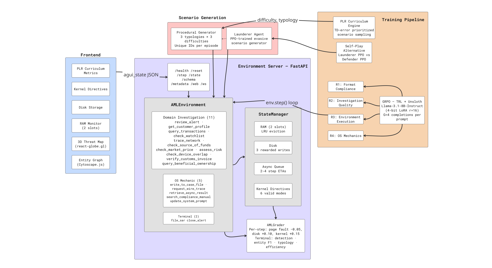

<div align="center">

# 🧠 Memex: The OS-Agent Benchmark

### *Can an LLM run its own Operating System?*

**A POMDP environment where language models manage Virtual Memory, handle Interrupts, and self-update their Kernel — all while solving $274B-scale financial crimes.**

[](https://github.com/openenv/openenv)
[](https://huggingface.co/spaces/MuazTPM/aml_investigation_env)
[]()
[]()
[]()

*Built for the Meta / Hugging Face OpenEnv Hackathon*

[Live Environment](https://huggingface.co/spaces/MuazTPM/aml_investigation_env) · [Blog Post](https://huggingface.co/spaces/MuazTPM/aml_investigation_env/blob/main/BLOG.md) · [Training Notebook](https://github.com/razancodes/Meta-Pytorch-Hackathon/blob/main/Memex_~_LarpLegends.ipynb) · [Training Guide](TRAINING.md) · [WandB Curves](https://wandb.ai/n0s0ktesting-testing-labs/memex-grpo)

</div>

---

## Quick Start

```bash
# 1. Verify the environment is live
curl https://muaztpm-aml-investigation-env.hf.space/health
# → {"status": "healthy"}

# 2. Run a test episode
curl -X POST https://muaztpm-aml-investigation-env.hf.space/reset \
  -H "Content-Type: application/json" -d '{"task_id": "easy"}'

# 3. View the Glass Box Visualizer
# Visit: https://muaztpm-aml-investigation-env.hf.space/

# 4. Trained model checkpoint
# https://huggingface.co/MuazTPM/defender-model
```

---

## What Is Memex?

Memex is an OpenEnv-compatible RL environment that tests whether an LLM can **operate** — not just answer questions. It layers three OS subsystems on top of an AML (Anti-Money Laundering) investigation task:

| OS Concept | What the Agent Must Do | Penalty for Failure |
|:-----------|:-----------------------|:-------------------:|
| **Virtual Memory** | Save critical evidence to disk before it's evicted from the 2-slot context window | Page Fault (−0.05) |
| **Interrupts** | Launch async wire traces, continue working, collect results after ETA | Async Timeout (−0.10) |
| **Kernel Updates** | Search the compliance manual and inject relevant rules into its own system prompt | Missed compliance rules → wrong verdicts |

The agent has **18 tools** across three categories, 3 AML typologies (structuring, layering, trade-based ML), 3 difficulty levels, and a procedural generator that creates unique scenarios on every `reset()` — making memorization impossible.

---

## Training

We train a **Meta-Llama-3.1-8B-Instruct** (4-bit via Unsloth) using TRL's `GRPOTrainer` with 4 decomposed reward functions:

| Reward | What It Scores |
|--------|---------------|
| **R1** Format Compliance | Is the output valid JSON with a known tool name? |
| **R2** Investigation Quality | Does the agent use diverse tools across categories? |
| **R3** Environment Execution | Multi-step `env.step()` against a deterministically-seeded scenario |
| **R4** OS Mechanics | Does the agent use disk writes, async traces, and kernel updates? |

```bash
# Dry-run (4 prompts, 1 epoch)
python train_grpo.py --dry-run

# Full training (v2 hyperparameters)
python train_grpo.py --num-prompts 250 --epochs 2 --lr 5e-6 --beta 0.04 \
    --output-dir checkpoints/defender-grpo-v2
```

See [TRAINING.md](TRAINING.md) for copy-paste Colab cells, full CLI reference, and hyperparameter details.

---

## Results

**WandB Dashboard:** [wandb.ai/n0s0ktesting-testing-labs/memex-grpo](https://wandb.ai/n0s0ktesting-testing-labs/memex-grpo)

150 steps on an A100, 3h 44m. The agent went from producing random single-tool outputs to running full multi-step investigations with all three OS mechanics.

### Training Curves


*Total reward trending from ~0 → ~4.5. R3 (environment execution) shows the strongest learning signal.*


*Healthy cosine LR decay. KL divergence stays bounded. `frac_reward_zero_std` drops to 0 — every GRPO group has reward variance.*


*Completion lengths grow from ~200 → ~800 tokens as the agent learns longer investigation chains.*

### Quantitative Improvement

| Metric | Step 0 | Step 150 |
|--------|:------:|:--------:|
| Total reward | ~0 | **~4.5** |
| R1 (format) | Mixed | **1.00** |
| R2 (investigation) | ~0.2 | **0.60** |
| R3 (env execution) | ~0 | **1.79** |
| R4 (OS mechanics) | 0.0 | **1.10** |
| Completion length | ~200 tok | **~800 tok** |

### Behavioral Change

| Behavior | Before Training | After Training |
|----------|:--------------:|:--------------:|
| Memory management | References evicted data → page faults | Writes evidence to disk before eviction |
| Async handling | Retrieves prematurely → timeouts | Interleaves work while waiting |
| Kernel updates | Ignores compliance rules | Searches manual, injects relevant mode |
| Investigation depth | 1-2 tool calls | 7-12 step investigation chains |
| Terminal decision | Always files SAR (lazy) | Correctly distinguishes TP vs TN |

---

## Architecture



---

## Tool Roster (18 Tools)

| Domain Investigation (11) | OS Mechanic (5) | Terminal (2) |
|:---|:---|:---|
| `review_alert` | `write_to_case_file` — Page to disk | `file_sar` |
| `get_customer_profile` | `request_wire_trace` — Async job | `close_alert` |
| `query_transactions` | `retrieve_async_result` — Fetch result | |
| `check_watchlist` | `search_compliance_manual` — Find rules | |
| `trace_network` | `update_system_prompt` — Kernel inject | |
| `check_source_of_funds` | | |
| `check_market_price` | | |
| `assess_risk` | | |
| `check_device_overlap` | | |
| `verify_customs_invoice` | | |
| `query_beneficial_ownership` | | |

---

## Reward Design

**Per-step** (dense signal):

| Event | Reward |
|-------|-------:|
| Action cost | −0.02 |
| Redundant call | −0.03 |
| Page fault | −0.05 |
| Async timeout | −0.10 |
| Disk write | +0.10 (cap 3/ep) |
| Kernel injection | +0.15 (cap 2/ep) |

**Terminal** (composite):

| Component | Weight |
|-----------|--------|
| Detection (TP/TN/FP/FN) | 1.0 |
| Entity F1 + Findings | 0.5 |
| Typology accuracy | 0.3 |
| Efficiency | 0.2 |
| OS mechanics | 0.2 |

Anti-gaming: 6 measures including hard caps, closed kernel modes, redundancy penalties, action costs, unique procedural IDs, and a formally proven "always SAR" trap (E[R_always_SAR] = 0.475 < E[R_reasonable] ≈ 0.68).

---

## Local Development

```bash
git clone https://github.com/razancodes/Meta-Pytorch-Hackathon.git
cd Meta-Pytorch-Hackathon
pip install -r requirements.txt

# Start server
uvicorn openenv_server:app --host 0.0.0.0 --port 8000

# Smoke tests (8/8)
python tests/test_smoke.py

# 1MDB demo
python demo_eval.py --dry-run

# Inference (any OpenAI-compatible LLM)
export API_BASE_URL="https://api.openai.com/v1"
export MODEL_NAME="gpt-4o-mini"
python inference.py
```

---

## Deployment

```bash
# Docker
docker build -t memex . && docker run -p 7860:7860 memex

# HF Spaces
openenv push --ignore-file .hfignore
# → https://huggingface.co/spaces/MuazTPM/aml_investigation_env
```

---

## Project Structure

```
.
├── openenv_server.py            # ★ OpenEnv FastAPI entrypoint
├── openenv.yaml                 # OpenEnv contract
├── models.py                    # Pydantic types (Action, Observation, State)
├── state_manager.py             # OS mechanics engine (RAM, Disk, Async, Kernel)
├── client.py                    # HTTP client (18 tool wrappers)
├── inference.py                 # ReAct inference agent
│
├── train_grpo.py                # ★ GRPO training (TRL + Unsloth)
├── self_play.py                 # Two-agent PPO self-play orchestrator
├── eval_harness.py              # Multi-typology evaluation harness
├── demo_eval.py                 # 1MDB demo + AGUI replay
│
├── server/
│   ├── aml_environment.py       # Core env (18 tools + OS mechanics)
│   ├── launderer_env.py         # Launderer single-step MDP
│   └── app.py                   # Standalone FastAPI server
├── scenarios/
│   ├── procedural_generator.py  # POMDP scenario builder
│   ├── adversary_agent.py       # Evasive scenario generator
│   ├── compliance_manual.py     # Searchable AML rule corpus
│   └── base.py                  # Scenario ABC
├── graders/
│   └── grader.py                # Dense reward engine
├── curriculum/
│   ├── plr_engine.py            # Prioritized Level Replay
│   └── oracle.py                # Proxy regret oracle
├── frontend/                    # Next.js Glass Box Visualizer
├── assets/                      # WandB training curve screenshots
├── archive/                     # Legacy scripts (PPO, DPO, hotswap, validators)
├── tests/
│   ├── test_smoke.py            # 8 end-to-end tests
│   └── test_plr.py              # PLR engine unit tests
├── Dockerfile                   # HF Spaces deployment
├── requirements.txt             # Runtime dependencies
└── .hfignore                    # HF push exclusions
```

---

## Further Reading

- **[BLOG.md](BLOG.md)** — Deep-dive: how we built the OS-agent concept, debugging zero-gradient GRPO, anti-gaming reward design, and the 1MDB demo walkthrough
- **[TRAINING.md](TRAINING.md)** — Copy-paste Colab cells, full CLI reference, hyperparameter tables, WandB monitoring guide

---

## License

MIT